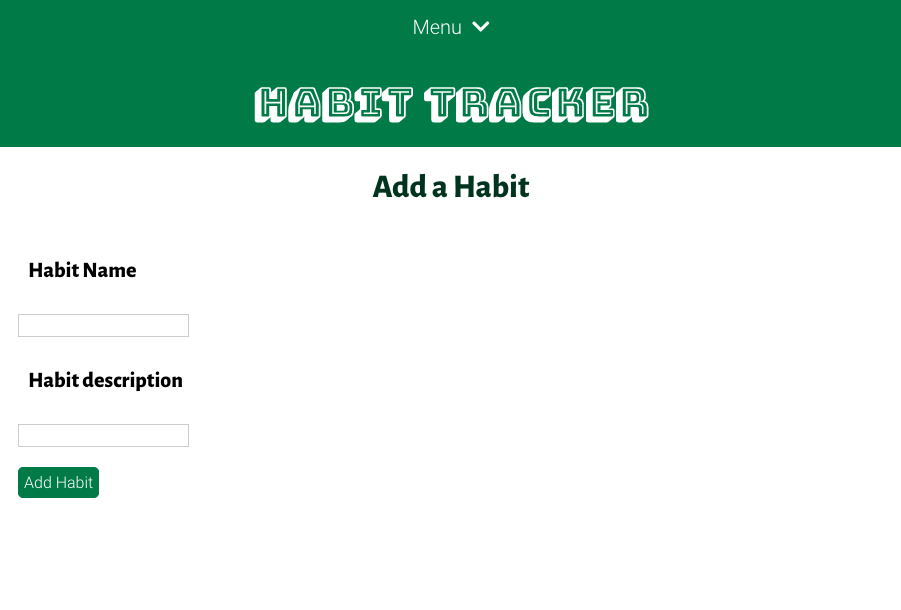
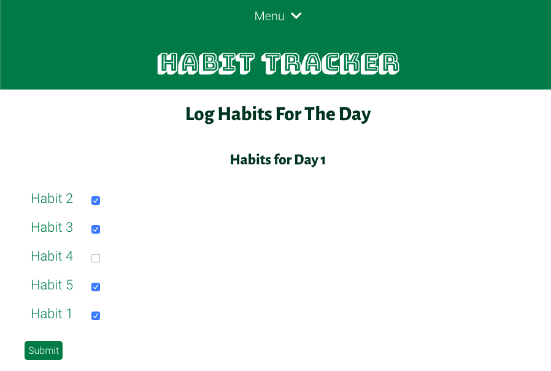
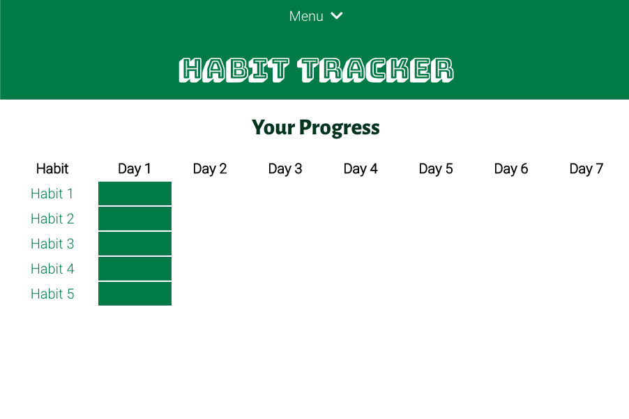
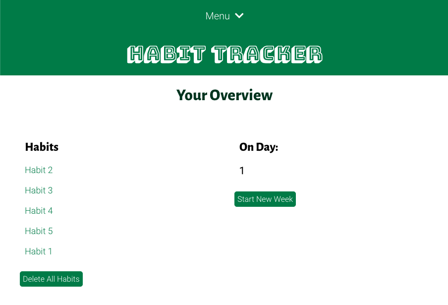

================

Link to Live Website
--------------------
https://habit-tracker-app.now.sh/

About the App
-------------
## An app that confirms that you are, in fact, still adulting
This quarantine's pretty stressful, to say the least. It's hard to maintain some semblance of normalcy while still being gentle with yourself, and to strike that balance between being productive and not putting too much pressure on yourself as you're coping with an unprecedented world event.

I created the Habit Tracker with this balance in mind– I wanted to create an app that lets you set tasks that you ideally want to do every day– but doesn't pressure you to do them at any particular time. Here's how it works– add a task (or two, or three), and everyday that you perform that task, log it in the tracker. You can view your progress and see how you did over the course of a week. Didn't do so hot? That's ok, with every new week, you get a fresh new slate to do better! The timespan of a week to track your habits is the ideal middle ground between taking it one day at a time, and giving yourself a flexible routine.

## Instructions
Start off by adding a habit on the Add Habit tab.

Log your progress everyday under the Log Day tab. 

See a graph of your habits' progress in the Progress tab. 

To see a summary of the habits you're tracking, what day you're on in the week, or to refresh to a new week go to the Overview tab.

Have fun tracking, and stay healthy, safe, and happy!

API Documentation
-----------------
## Habits

GET '/api/habits' - Gets all habits

POST '/api/habits' - Posts new habit

DELETE '/api/habits' - Deletes all habits

GET '/api/habits/:habitId' - Gets a habit by ID

PATCH '/api/habits/:habitId' - Updates habits by ID

## Habit History

GET '/api/habithistory' - Gets all history

POST '/api/habithistory' - Posts new history for a habit

DELETE '/api/habithistory' - Deletes all history

PATCH '/api/habithistory' - Updates entire habit history table with a new table

GET '/api/habithistory/:habitId' - Gets a habits history by the habit ID

## Days

GET '/api/days' - Gets all days

DELETE '/api/days' - Deletes all days

PATCH '/api/days' - Updates entire days table

## Errors
The API uses conventional HTTP response codes for error signalling. Common error codes are as follows:

200- OK 

400- Bad request, often due to missing parameter

401- Unauthorized, no valid API key. Log back in with credentials or sign up for an account if you don't have one.

403- Forbidden, your API key doesn't have the credentials to perform this request

404- Not found, bad endpoint. Check for typos.

500, 502, 503, 504 - Server Errors	Something went wrong on the API's end.

Tech Used
---------
Client: ReactJS, React Router, JSX, Javascript, JSON, HTML, CSS

API: Javascript, Node, Express, RESTful APIs, Helmet, XSS, Morgan, Postgres, PSQL, DBeaver, CORS, knex, Chai 